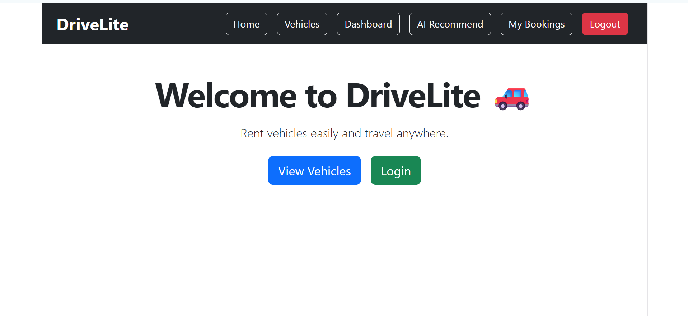
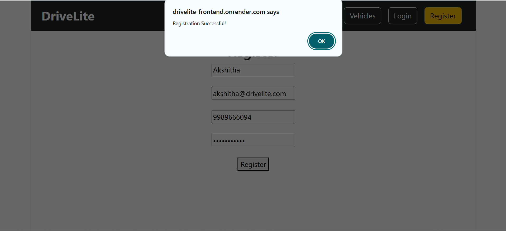
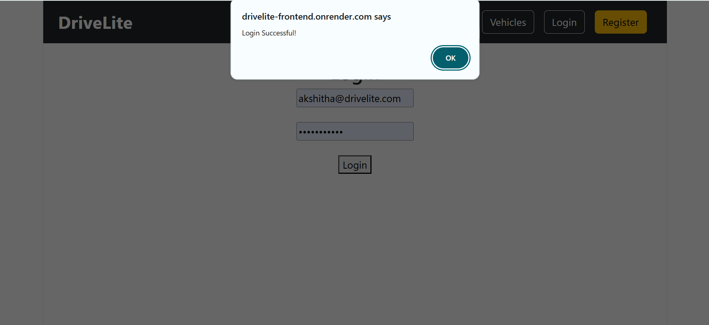
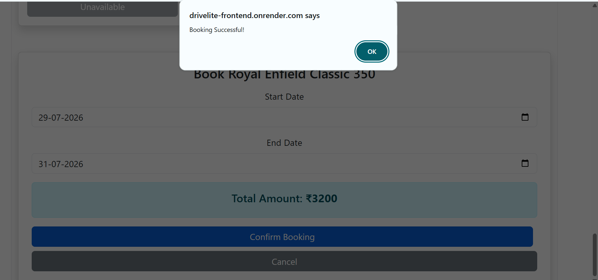
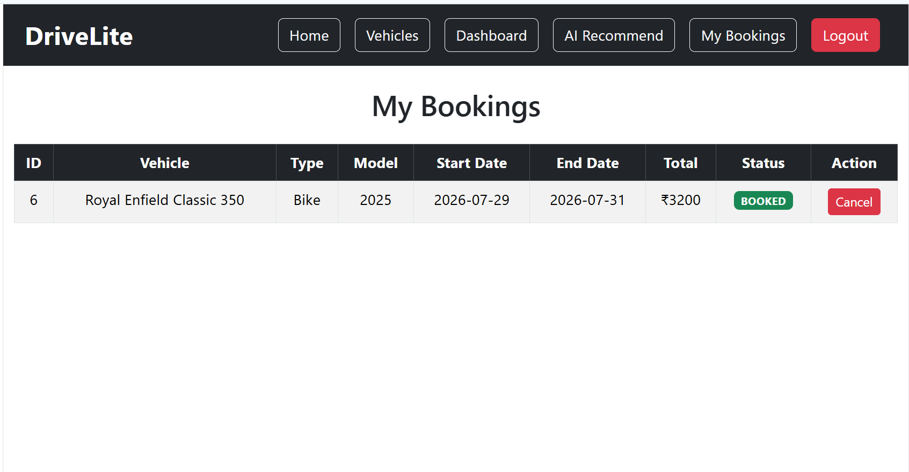
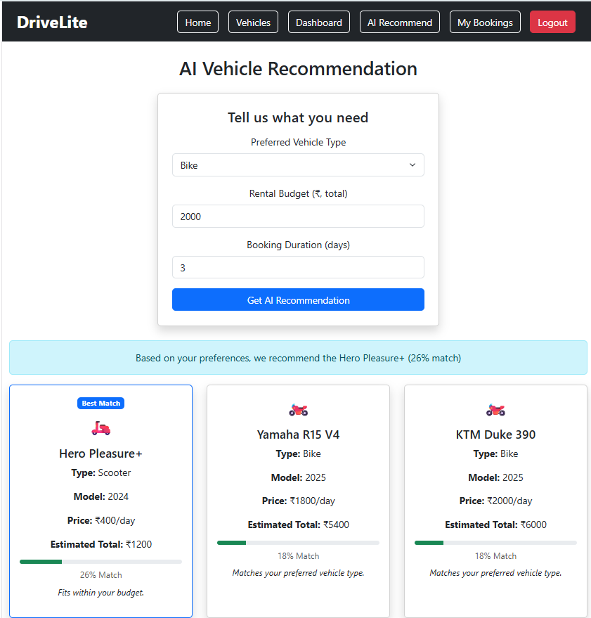

# DriveLite AI Enhanced Vehicle Rental System 🚗


An AI-powered full-stack vehicle rental platform that provides vehicle browsing, booking management, and intelligent vehicle recommendations based on user preferences.

## 🌐 Live Demo

Frontend:
https://drivelite-frontend.onrender.com

Backend API:
https://drivelite-backend.onrender.com

AI Service:
https://drivelite-ai-service.onrender.com


## 🎥 Project Demo

Watch the project demonstration here:

[▶️ DriveLite Demo Video](demo/drivelite-demo.mp4)

---

# Features

## User Management
- User registration and login
- JWT based authentication
- Secure API access

## Vehicle Rental System
- View available vehicles
- Search and filter vehicles
- Book vehicles
- View booking history
- Cancel bookings

## AI Vehicle Recommendation
- Machine learning based recommendations
- User preference analysis
- Budget-aware suggestions
- Match score prediction
- Alternative vehicle recommendations

---

# Tech Stack

## Frontend
- React.js
- Vite
- Axios
- React Router

## Backend
- Java
- Spring Boot
- Spring Security
- JWT Authentication
- Hibernate / JPA

## Database
- MySQL

## AI Microservice
- Python
- Flask
- Scikit-learn
- Random Forest Classification Model

## Deployment
- Render
- GitHub

---

# System Architecture

                User
                  |
                  |
          React Frontend
          (Vite + Axios)
                  |
                  |
         Spring Boot Backend
                  |
    ----------------------------
    |                          |
    |                          |
 MySQL Database        AI Recommendation Service
                        (Flask + ML Model)


## API Documentation

### Authentication APIs

| Method | Endpoint | Description |
|--------|----------|-------------|
| POST | `/auth/register` | Register a new user |
| POST | `/auth/login` | Login user and generate JWT token |

---

### Vehicle APIs

| Method | Endpoint | Description |
|--------|----------|-------------|
| GET | `/vehicles` | Get all available vehicles |
| GET | `/vehicles/{id}` | Get vehicle by ID |
| POST | `/vehicles` | Add new vehicle (Admin) |
| PUT | `/vehicles/{id}` | Update vehicle details |
| DELETE | `/vehicles/{id}` | Delete vehicle |

---

### Booking APIs

| Method | Endpoint | Description |
|--------|----------|-------------|
| POST | `/bookings` | Create a vehicle booking |
| GET | `/bookings/my` | View user's bookings |
| PUT | `/bookings/{id}/cancel` | Cancel booking |

---

### AI Recommendation API

| Method | Endpoint | Description |
|--------|----------|-------------|
| POST | `/ai/recommend` | Get AI-based vehicle recommendations |

Example Request:

```json
{
  "budget": 500,
  "vehicleType": "Scooter",
  "duration": 3,
  "purpose": "Daily commute"
}
---

# AI Recommendation Flow

1. User enters preferences:
   - Vehicle type
   - Budget
   - Rental duration

2. Backend sends vehicle information to AI service.

3. Machine learning model predicts suitable vehicles.

4. System returns:
   - Top recommendation
   - Match score
   - Alternative vehicles

---

# Project Structure

drivelite
|
├── drivelite-frontend
|
├── drivelite-backend
|
└── drivelite-ai-service


---

# Local Setup

## Backend

cd drivelite-backend
mvn spring-boot:run


Runs on:
http://localhost:8080


---

## Frontend

cd drivelite-frontend
npm install
npm run dev


Runs on:
http://localhost:5173


---

## AI Service

cd drivelite-ai-service
pip install -r requirements.txt
python app.py


Runs on:
http://localhost:5000


---

# Future Improvements

- Payment gateway integration
- Advanced recommendation algorithms
- Vehicle availability prediction
- Admin analytics dashboard

---

## Author

Akshitha2111

## Screenshots

### Home Page


### Register Page


### Login Page


### Vehicle Booking


### My Bookings


### AI Recommendation

